# Mise en place de l’émulateur Android pour MobSF

##  Objectif
Préparer un environnement Android sécurisé et compatible avec **MobSF** afin d’analyser des applications APK dans de bonnes conditions  
(émulateur rooté, sans Play Store).

---

##  Prérequis
 Les outils suivants sont installés :
- **Android Studio** (avec SDK et ADB)
- **Docker Desktop** (en cours d’exécution)
- **Git**
<p align="center"> 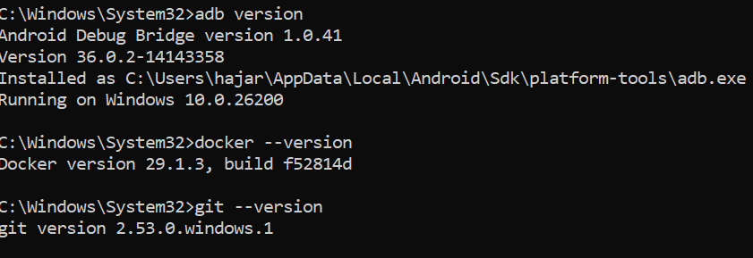 </p>

---

##  Étape 1 : Création de l’AVD 

Création d’un émulateur Android depuis **Android Studio** :
<p align="center"> 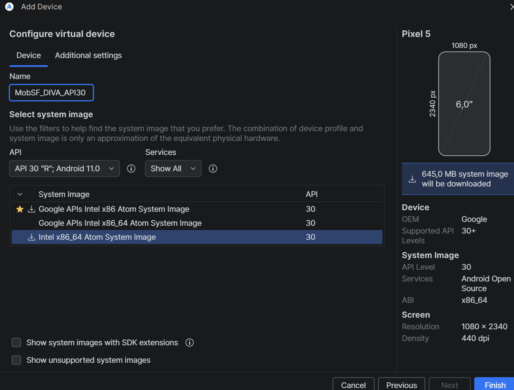 </p>
<p align="center"> 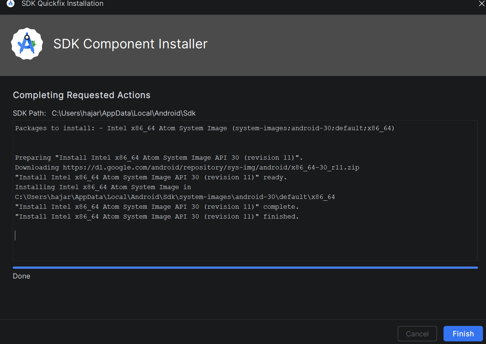 </p>
<p align="center"> 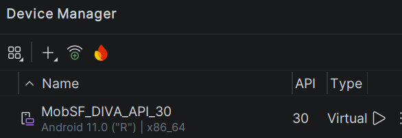 </p>
Résultat : un émulateur propre, sans services Google, prêt pour l’analyse de sécurité.

---


##  Étape 2 : Récupération de MobSF

Cloner le projet **MobSF** :
<p align="center"> 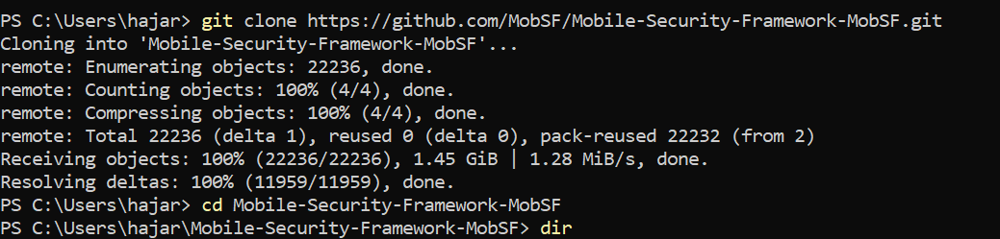 </p>
---

## Étape 3 : Lancement de l’émulateur avec MobSF:
On Utilise le script fourni par MobSF pour démarrer l’émulateur automatiquement configuré.
<p align="center"> 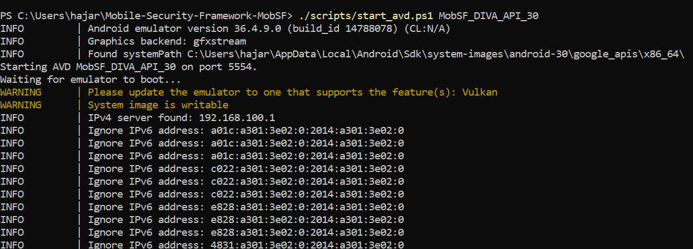 </p>
<p align="center"> 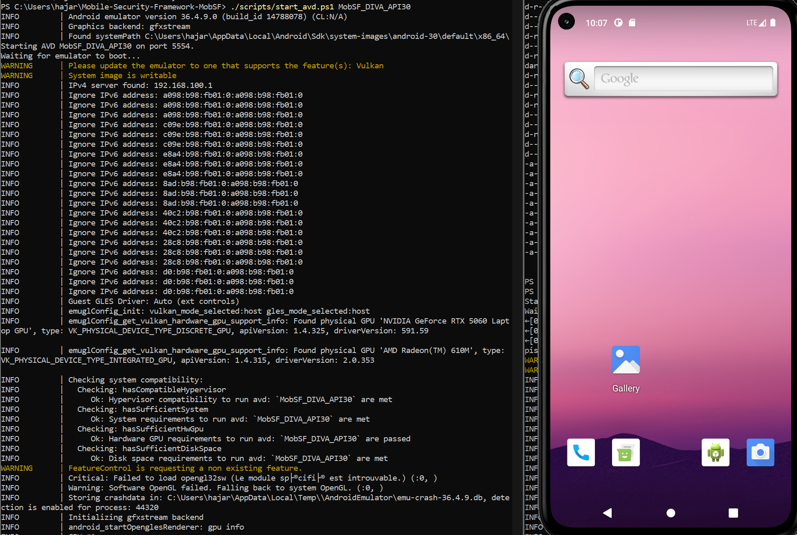 </p>
### Vérification:
Après le démarrage, vérifier que l’émulateur est bien détecté :
<p align="center"> 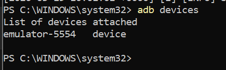 </p>

---

## Étape 4 : Installation et lancement de MobSF (Docker)

### Téléchargement de l’image
<p align="center"> 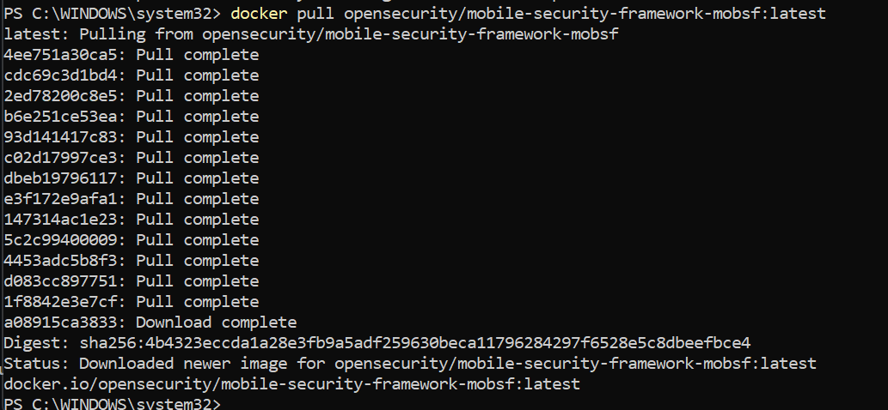 </p>

```bash
docker pull opensecurity/mobile-security-framework-mobsf:latest
```
### Lancement de MobSF:
<p align="center"> 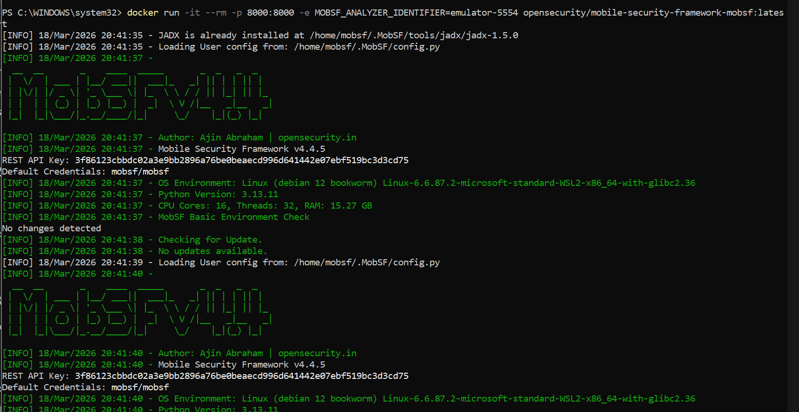 </p>

### Accès à l’interface
<p align="center"> 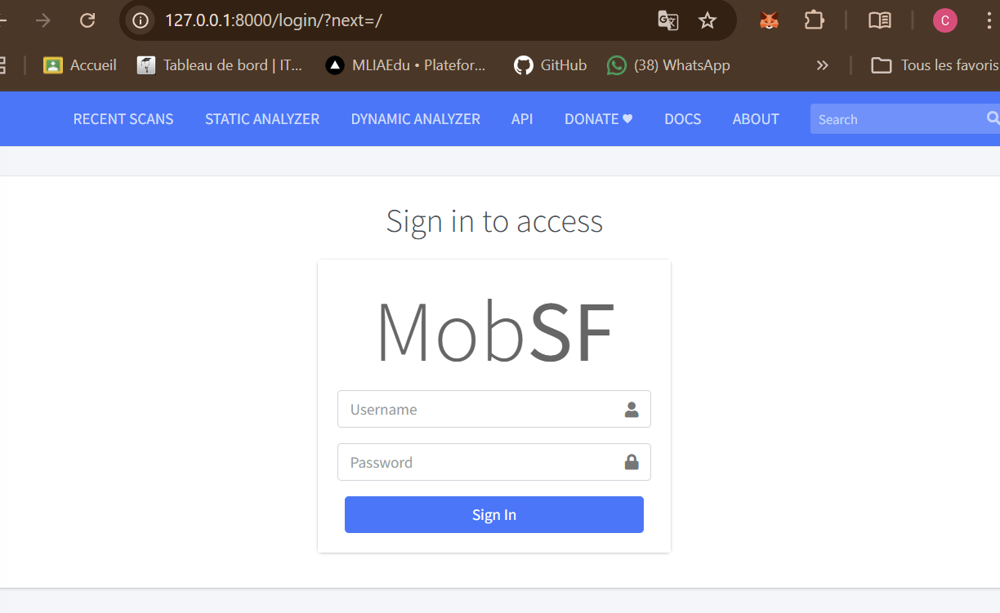 </p>

### Identifiants : Username : mobsf - Password : mobsf

## Étape 5 : Téléchargement de DIVA:
<p align="center"> 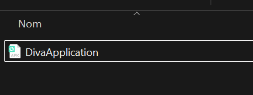 </p


##  Étape 6 : Analyse Statique + Dynamique de DIVA

###  Objectif
Analyser l’application vulnérable **DIVA** avec **MobSF** en combinant :
- Analyse statique
- Analyse dynamique

---

## 📊 1. Analyse statique

### 🔹 Procédure
1. Accéder à l’interface de MobSF :
<p align="center"> 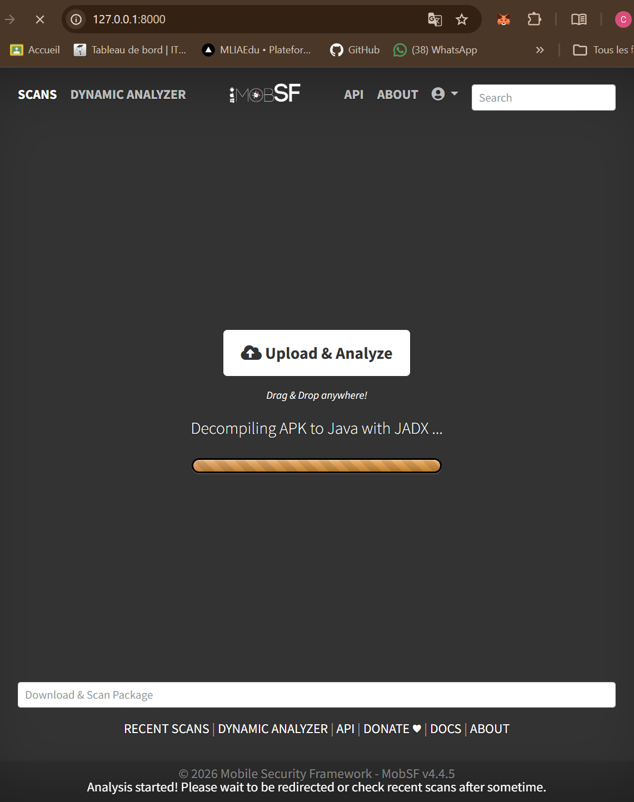 </p>
 ```
http://127.0.0.1:8000
```
2. Cliquer sur **Upload & Analyze**
3. Importer le fichier `diva.apk`
4. Attendre la fin de l’analyse

<p align="center"> 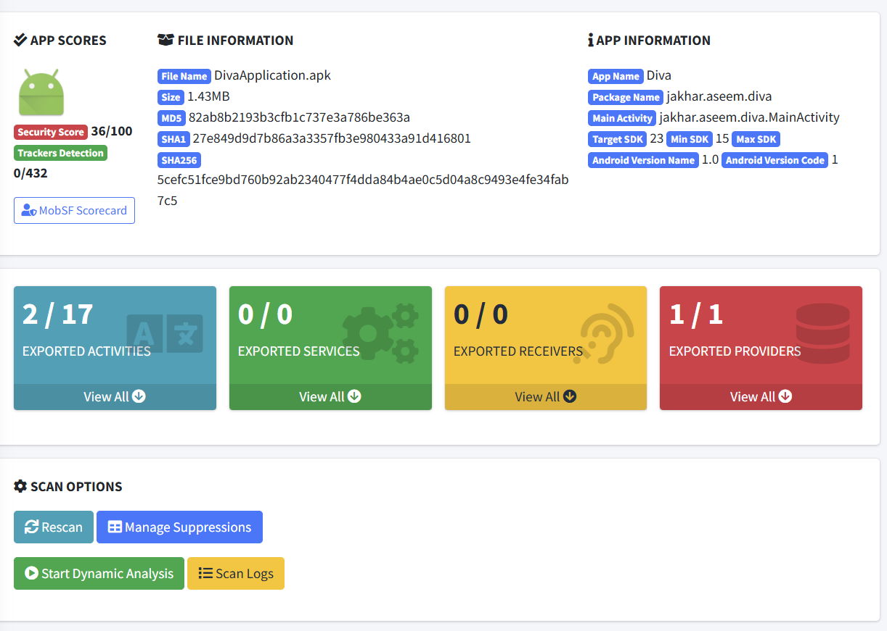 </p>

### Résultats observés:
- Analyse du **AndroidManifest.xml**
- Liste des **permissions**
- Extraction du **code source**
- Identification de vulnérabilités :
- Données sensibles exposées

##  2. Analyse dynamique

### Lancement
1. Dans le rapport statique → cliquer sur :
 ```
Start Dynamic Analyzer
```

2. Dans l’émulateur :
<p align="center"> 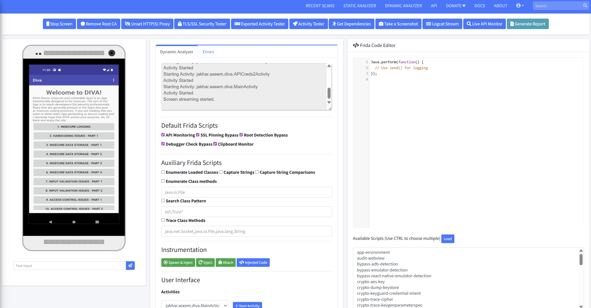 </p>
<p align="center"> 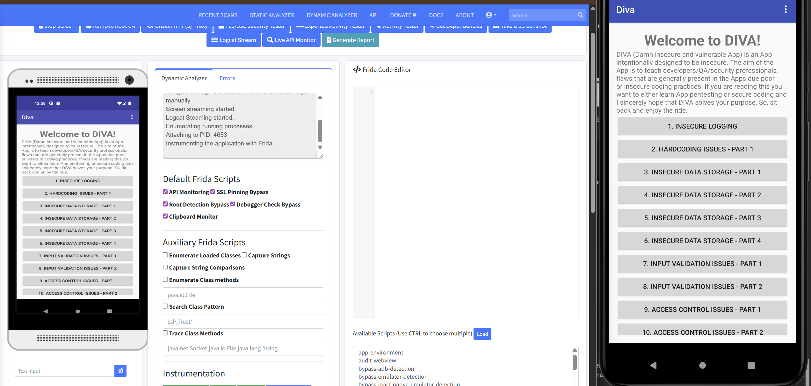 </p>
- Lancer l’application **DIVA**
- Explorer les différents challenges :
- Insecure Logging
- Hardcoded Issues
- Insecure Data Storage
- Access Control
- etc. (13 challenges)

---
#  Tests Dynamiques Réalisés

## 1️ Injection Frida (Spawn & Inject)

### Procédure
Dans MobSF :

1. Ouvrir **Dynamic Analyzer**
2. Cliquer sur : Spawn & Inject
3.  Charger le script :

### Objectif
Surveiller l’utilisation de **SharedPreferences** afin de détecter si l’application stocke des données sensibles.

---

### Test effectué

Dans l’application DIVA :

- Saisie :
 ```
username : test
password : 1234
```

Après interaction avec l’application, MobSF a généré les logs suivants :
<p align="center"> 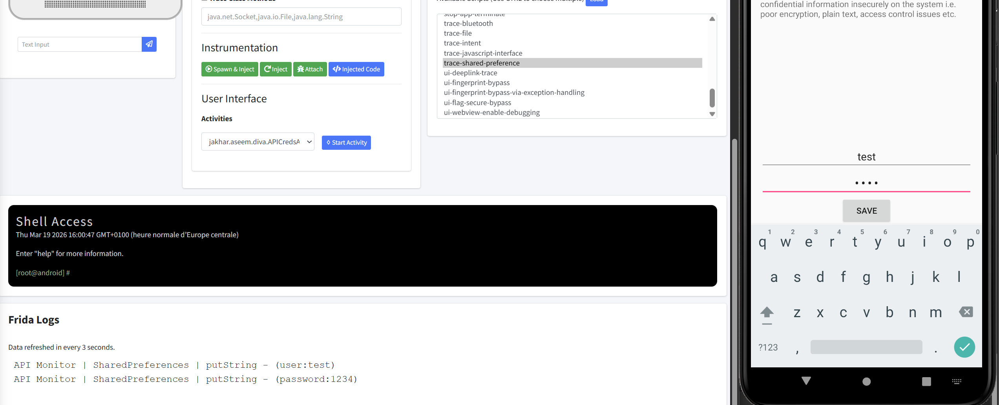 </p>

Risque identifié :
Stockage potentiel de données sensibles dans le stockage local.

---

# 2️ Activity Exploration

### Objectif
Explorer les activités internes de l’application et détecter des écrans cachés ou non protégés.

### Procédure

Dans MobSF :

1. Aller dans :
```
Activity Tester
```

2. Lancer plusieurs activités de l’application.
<p align="center"> 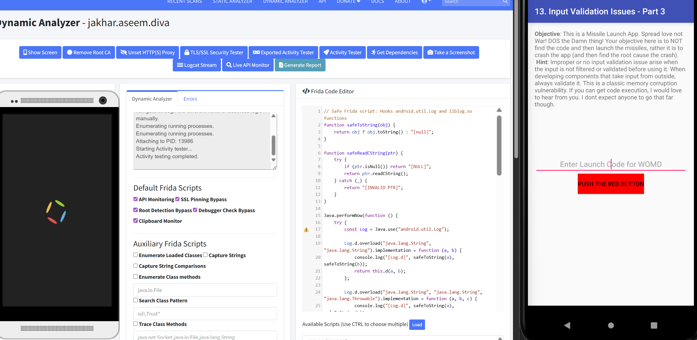 </p>

### Résultat
-  Découverte de plusieurs activités internes  
-  Accès possible à certains écrans sans authentification  
- Identification de surfaces d’attaque potentielles

---

# 3️ TLS / SSL Security Test
<p align="center"> 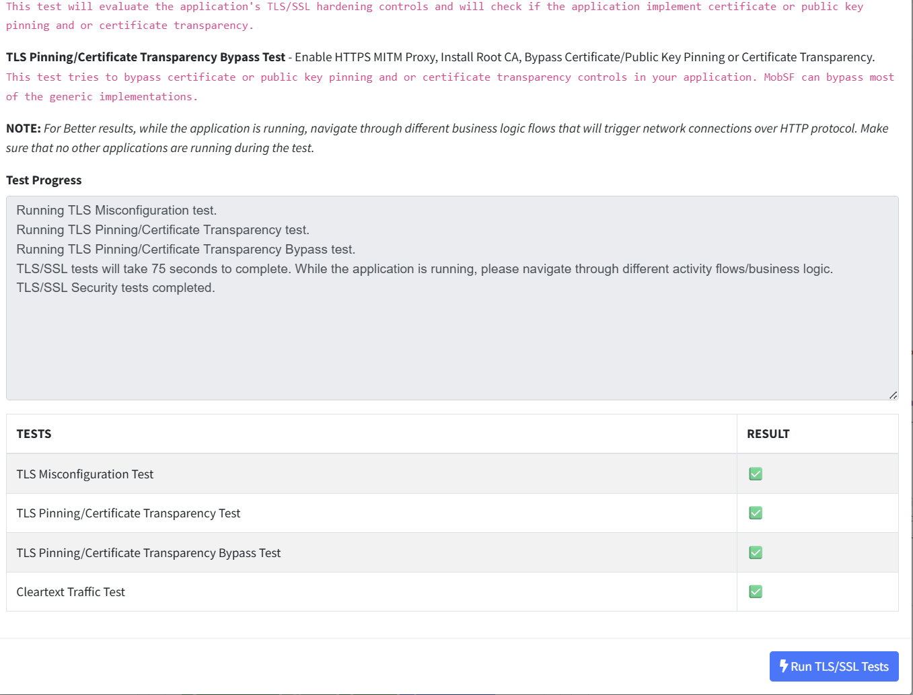 </p>
### Objectif
Tester la sécurité des communications réseau de l’application.

### Procédure
```
TLS/SSL Security Tester
```
MobSF effectue automatiquement des tests de sécurité sur les connexions réseau.

---

### Vérifications effectuées

- Validation du certificat SSL
- Analyse du pinning certificat
- Détection de vulnérabilités TLS

---


#  Résumé des Tests Dynamiques

| Test | Objectif | Résultat |
|------|----------|----------|
| Frida Injection | Surveiller stockage local | Détection de `SharedPreferences.putString()` |
| Activity Tester | Explorer les activités | Découverte d’écrans internes |
| TLS/SSL Tester | Vérifier la sécurité réseau | Analyse de la configuration SSL |

---

### 6.4 — Logcat Stream en temps réel

<p align="center">  </p>

En ciblant le flux Logcat pour le package `jakhar.aseem.diva`, les événements système liés à l'application s'affichent en temps réel (ex: évènements `PACKAGE_ADDED` ou vérifications `MediaProvider`).

**Utilité :** Ce flux en live est indispensable pour repérer d'éventuelles fuites d'informations et valider le Challenge #1 (Insecure Logging). Des mots de passe ou tokens peuvent y être repérés si les développeurs ont omis de filtrer leurs journaux en production.


### 6.6 — Exploration des Challenges DIVA avec le Dynamic Analyzer

*    — Access Control Issues (Tveeter API Credentials) :** 
    <p align="center"> 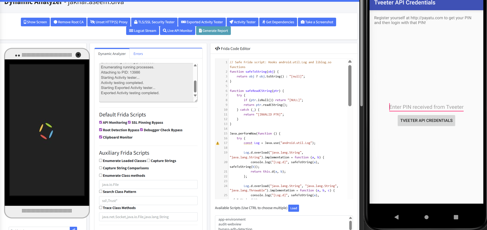 </p>
    Le Challenge "Tveeter API Credentials" est lancé. Sur l'émulateur, DIVA requiert un PIN Tweeter virtuel. Sur le back-office, MobSF démontre sans effort le manque de sécurisation des accès vers cette activité exportée. Les analyses *Activity tester* et *Exported Activity tester* complètent cette démarche structurelle.

*    — Input Validation Issues Part 3 :**
    <p align="center">  </p>
    Dans l'interface "Missile Launch", le but du jeu est de provoquer un crash en insérant des données non sanitaires. Cela trahit une lacune de type "memory corruption / buffer overflow" au cœur des fonctions natives (C/C++ via JNI) de l'application cible, tracée assidûment par MobSF en arrière-plan.

### 6.7 — Instrumentation Frida Avancée

Depuis "Available Scripts", de multiples ressources communautaires peuvent être injectées.

*   **Utilisation du script `bypass-emulator-detection` :**
   
    Un script (créé par *Areizen_*) est appliqué pour esquiver la détection émulée, neutralisant `bypass_build_properties()`, `bypass_phonenumber()`, `bypass_deviceid()`, `bypass_imsi()` et `bypass_operator_name()`. Son injection se réalise grâce aux options *Spawn & Inject*, *Inject* ou *Attach*.
  <p align="center">  </p>
*   **Script `crypto-aes-key` — Interception de clés de chiffrement :**
    <p align="center">  </p>
    En choisissant `crypto-aes-key`, le script s'introduit pour lister les appels à la fonction `SecretKeySpec`. Cela permet de consigner au passage les clés hexadécimales AES. En parallèle, les options octroient un terminal administrateur de l'émulateur sous la forme `[root@android] #`.

*   **Code Frida injecté — Injected Frida Script :**
    <p align="center">  </p>
    Une fenêtre flottante valide visuellement le code propulsé en mémoire. On peut y observer le bridge *Frida 17+* et les appels `getLoadedClasses()` / `getAllMethods` pour énumérer classes et méthodes à la volée.

### 6.8 — Rapport Dynamique Final

<p align="center"> 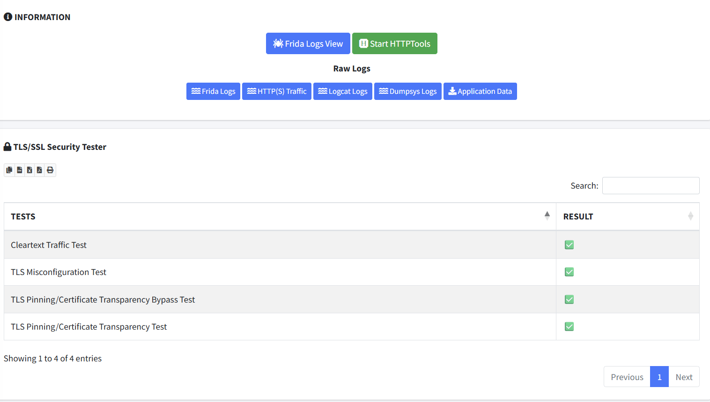 </p>
<p align="center"> 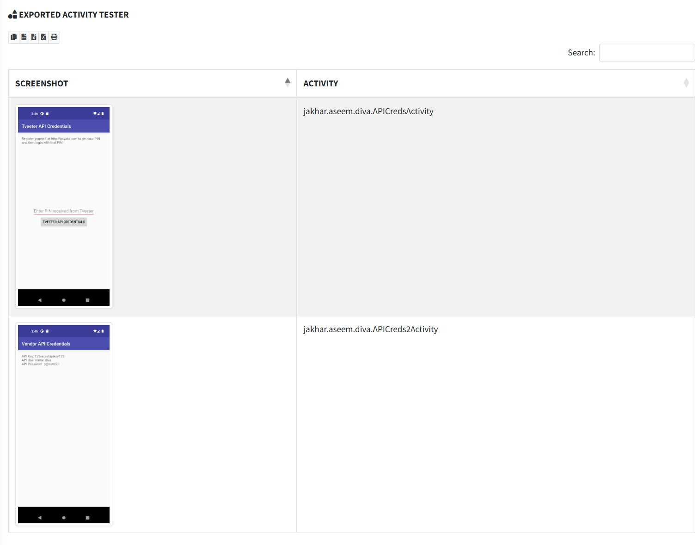 </p>
Via la génération finale, un rapport complet et structuré émerge avec son index de navigation latéral. On y retrouve l'Information, les vulnérabilités vérifiées (TLS/SSL Security Tester, Exported Activity Tester), ainsi que les traces techniques de l'analyse réseau (HTTP(S) Traffic) et systèmes (Logcat, Dumpsys).

---

## Étape 7 — Tests avancés & Exploration

À l'issue de l'analyse initiale, la manipulation libre s'impose pour approfondir l'évaluation.

### 7.1 — Exploration des challenges DIVA
Pour valider l'impact réel de l'application vulnérable :
1.  Lancez chaque activité correspondante sur le téléphone émulé.
2.  Observez instantanément l'apparition de nouvelles lignes compromettantes dans le **Logcat Stream**.
3.  Vérifiez la nature des requêtes dans la section **HTTP(S) Traffic**.
4.  Examinez l'origine des traces suspectes au sein des dossiers de l'application en utilisant le **File Monitor**.

### 7.2 — Injection Frida personnalisée
L'injection personnalisée surligne l'impact d'une modification logique au runtime :
```javascript
Java.perform(function() {
    var MainActivity = Java.use("jakhar.aseem.diva.MainActivity");
    MainActivity.someMethod.implementation = function() {
        console.log("[*] someMethod() intercepted!");
        return this.someMethod(); // Renvoie au comportement original
    };
});
```

